# Mermaid Diagrams Skill

## Purpose
Create clear, well-structured mermaid diagrams for documentation and visualization.

## When to Use
- Visualizing system architecture
- Documenting workflows and processes
- Creating entity relationship diagrams
- Illustrating sequences and interactions
- Building state machines and flowcharts

## Diagram Types

### 1. Flowchart
Best for: Decision trees, process flows, algorithms

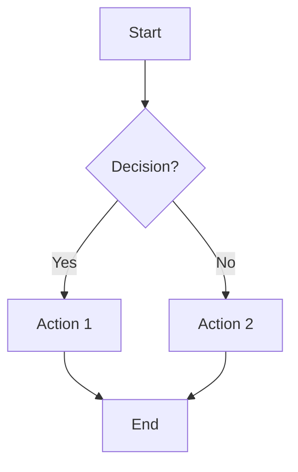

**Syntax Reference:**
```
flowchart TD|TB|BT|LR|RL
    node[Rectangle]
    node(Rounded)
    node([Stadium])
    node[[Subroutine]]
    node[(Database)]
    node((Circle))
    node{Diamond}
    node{{Hexagon}}
    node[/Parallelogram/]
```

**Direction Options:**
- `TD` / `TB` - Top to bottom
- `BT` - Bottom to top
- `LR` - Left to right
- `RL` - Right to left

### 2. Sequence Diagram
Best for: API calls, message passing, interactions over time

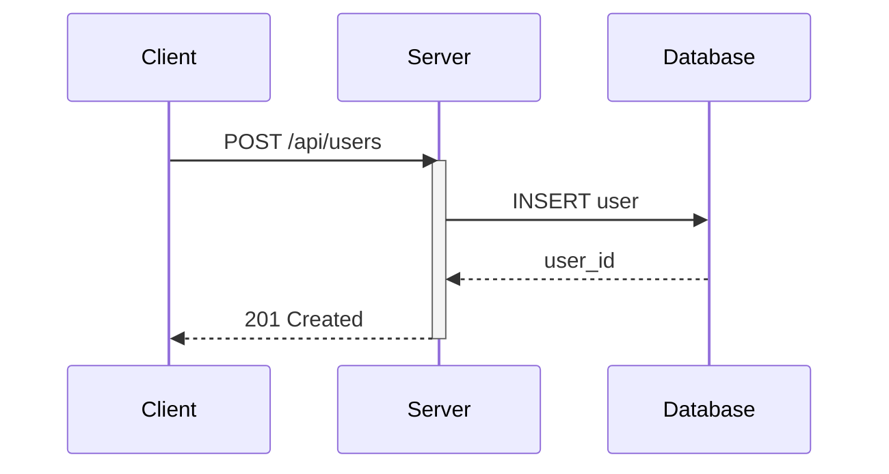

**Arrow Types:**
```
->    Solid line without arrow
-->   Dotted line without arrow
->>   Solid line with arrowhead
-->>  Dotted line with arrowhead
-x    Solid line with cross
--x   Dotted line with cross
-)    Solid line with open arrow
--)   Dotted line with open arrow
```

**Activation:**
```
activate Actor
deactivate Actor
```

**Notes:**
```
Note right of Actor: Text
Note left of Actor: Text
Note over Actor1,Actor2: Text
```

### 3. Entity Relationship Diagram
Best for: Database schemas, data models

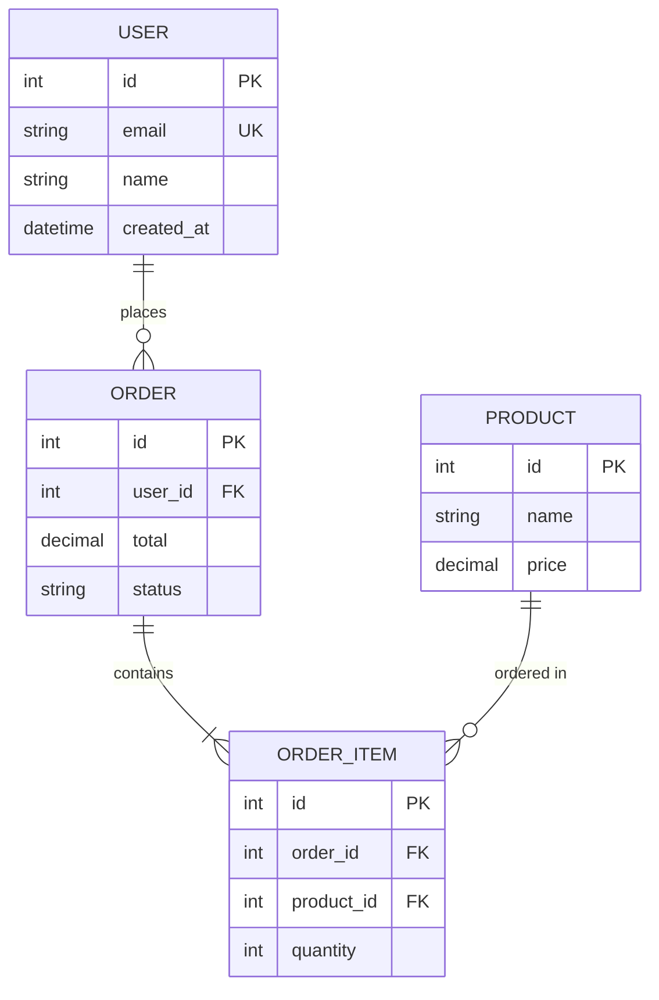

**Relationship Syntax:**
```
||--||  One to one
||--o{  One to many
o{--o{  Many to many
||--|{  One to one or more
```

**Attribute Types:**
- `PK` - Primary Key
- `FK` - Foreign Key
- `UK` - Unique Key

### 4. State Diagram
Best for: State machines, lifecycle diagrams

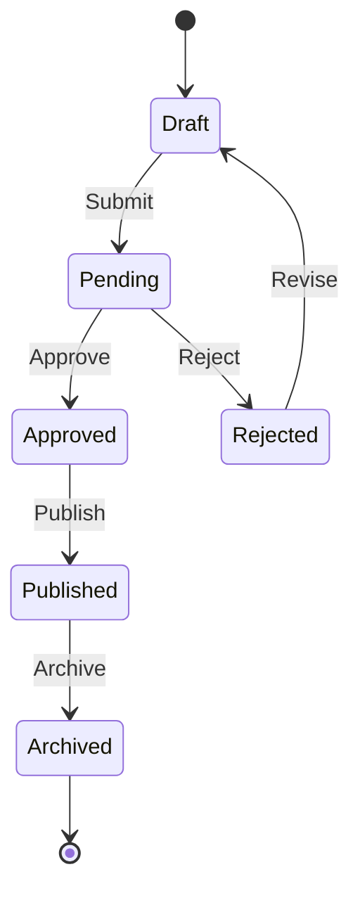

**Syntax:**
```
[*]           Start/End state
state "Name"  Named state
-->           Transition
: label       Transition label
```

**Composite States:**
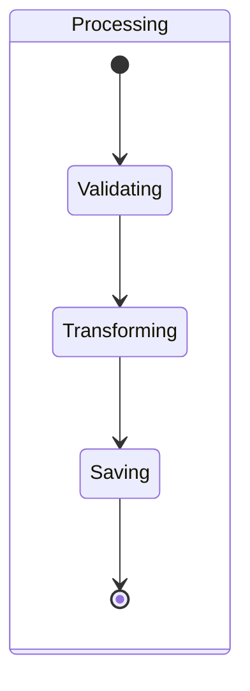

### 5. Class Diagram
Best for: Object-oriented design, API structures

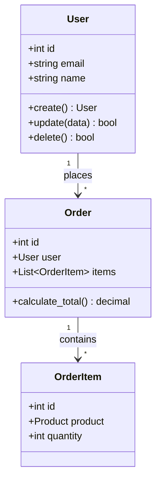

**Visibility:**
- `+` Public
- `-` Private
- `#` Protected
- `~` Package/Internal

### 6. Gantt Chart
Best for: Project timelines, schedules

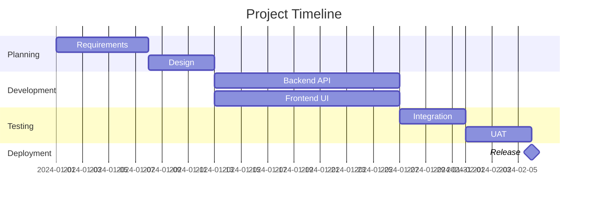

### 7. Pie Chart
Best for: Distribution, proportions

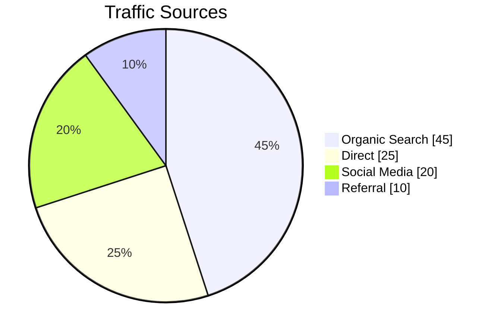

### 8. Git Graph
Best for: Branch strategies, git workflows

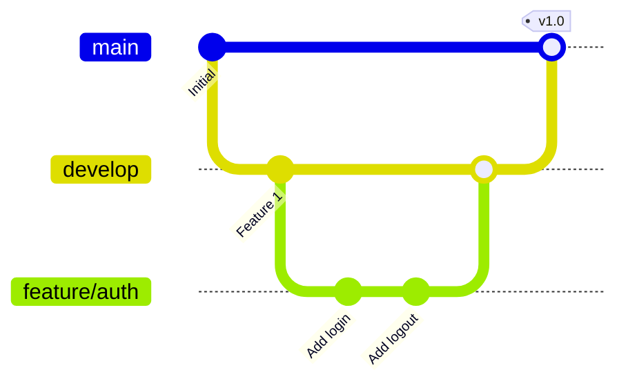

### 9. C4 Context Diagram
Best for: System context, architecture overview

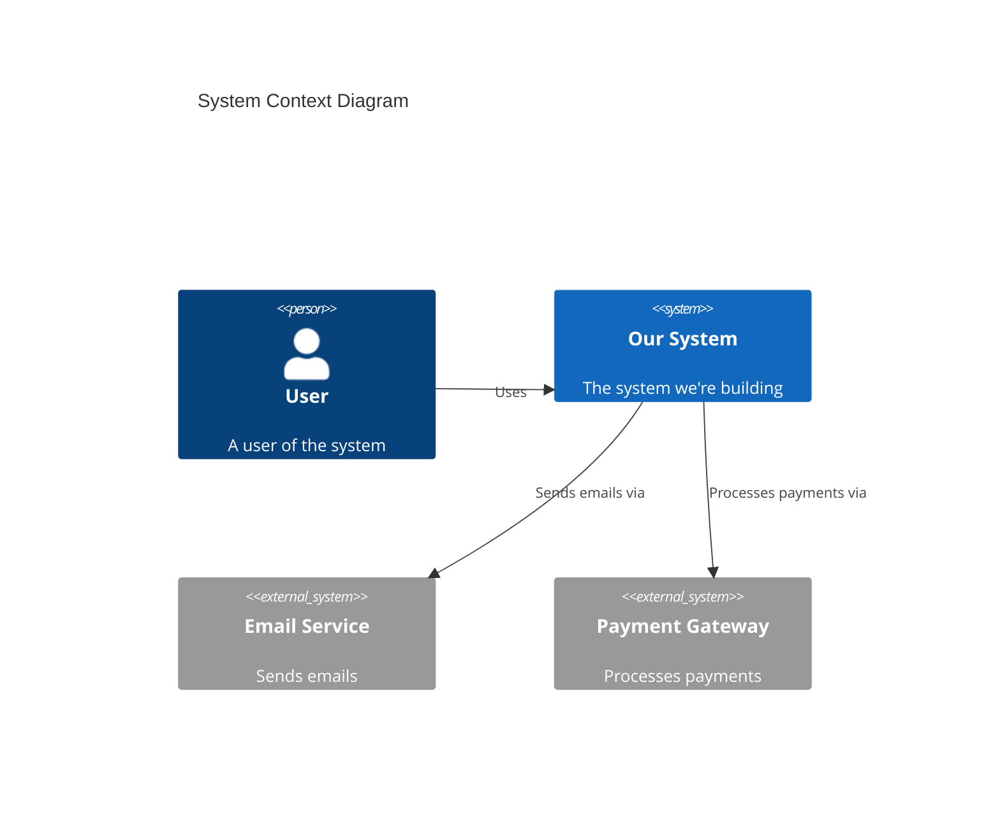

## Best Practices

### Clarity
- Keep diagrams focused on one concept
- Use clear, descriptive labels
- Limit nodes to what's essential
- Use consistent naming conventions

### Layout
- Choose direction based on content (LR for timelines, TD for hierarchies)
- Group related elements
- Use subgraphs for logical grouping

### Styling
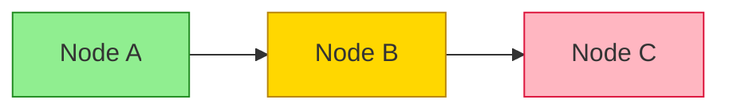

### Subgraphs
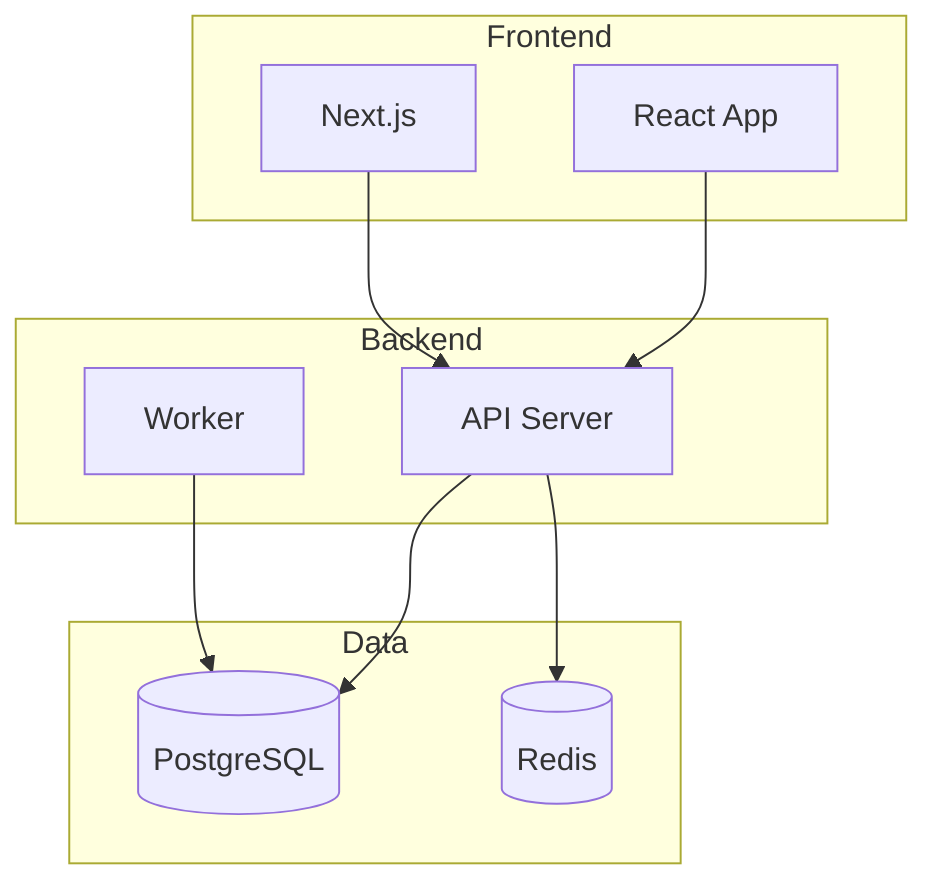

## Diagram Selection Guide

| Use Case | Diagram Type |
|----------|--------------|
| Process/workflow | Flowchart |
| API interactions | Sequence |
| Database schema | ERD |
| Object design | Class |
| State transitions | State |
| Project timeline | Gantt |
| Proportions | Pie |
| Git workflow | Git Graph |
| System overview | C4 Context |

## Common Patterns

### API Flow
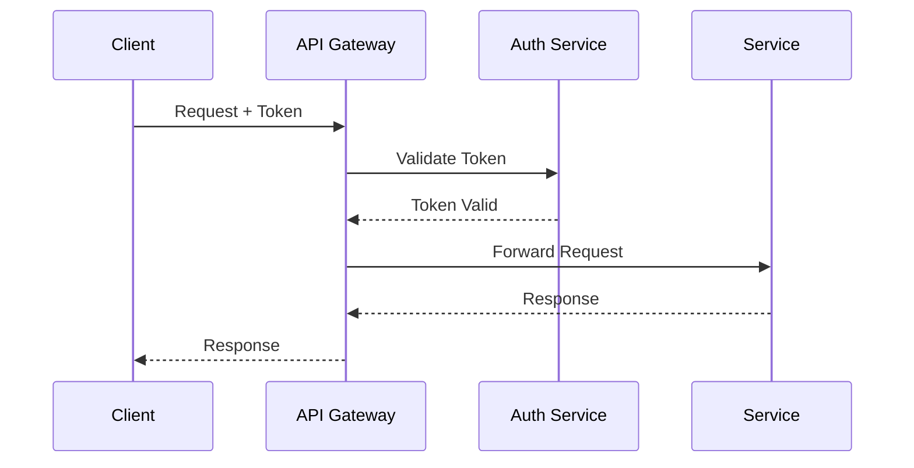

### Microservices Architecture
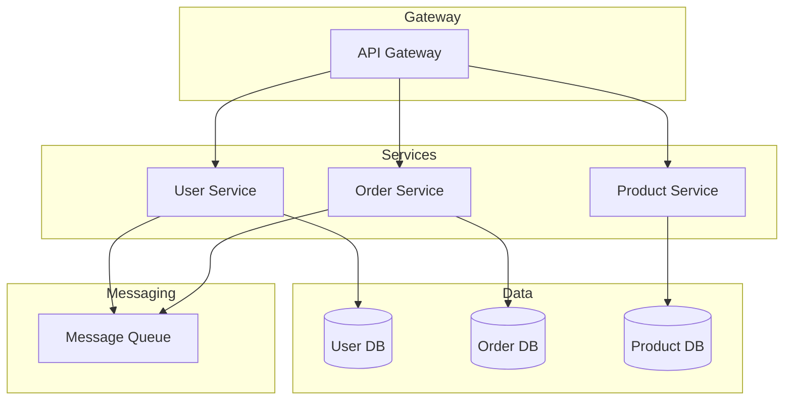

### CI/CD Pipeline
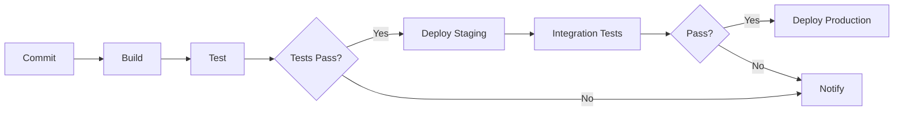

## Integration Notes

This skill is used in conjunction with:
- `obsidian-publisher` - Obsidian renders mermaid natively
- `joplin-publisher` - Joplin supports mermaid in markdown

Diagrams should be embedded as fenced code blocks:
~~~markdown
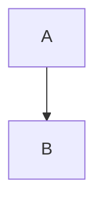
~~~
