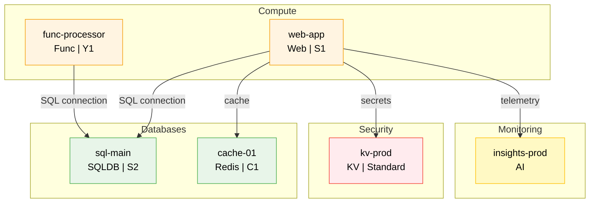
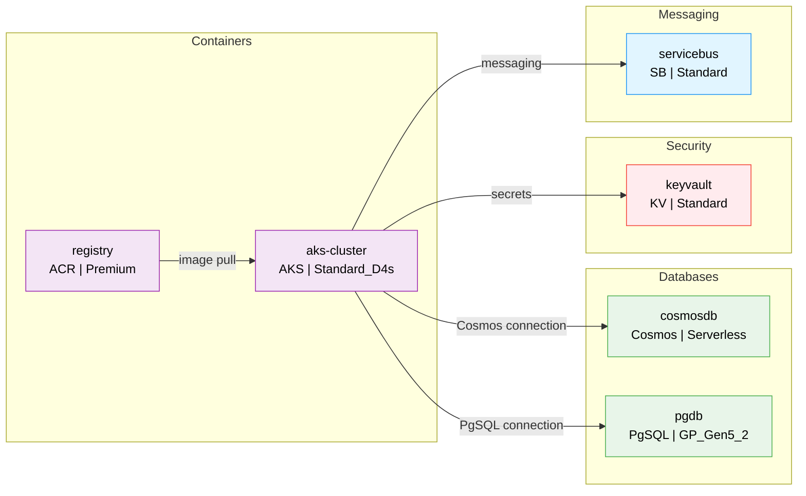
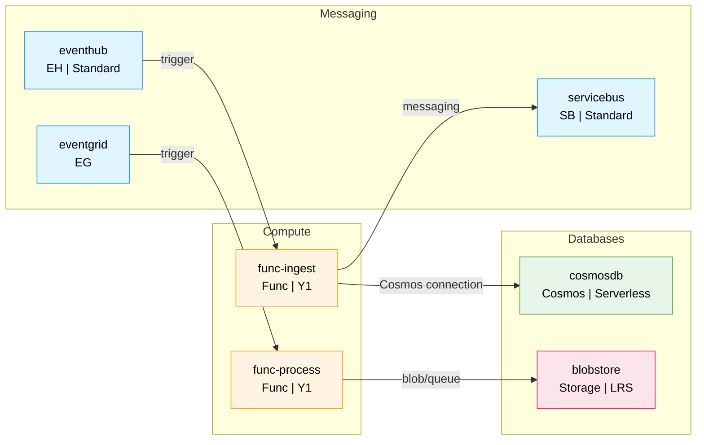

# Azure Resource Discovery

Patterns for discovering Azure resources, mapping relationships, and generating architecture diagrams.

**SAFETY: All discovery operations are strictly READ-ONLY. NEVER create, modify, or delete Azure resources. Only use list/get/read MCP tool operations. This skill is for observation and documentation only.**

## When to Use

- Documenting existing Azure infrastructure for team onboarding
- Onboarding to a new Azure environment you haven't worked in before
- Audit and compliance — generating an inventory of deployed resources
- Architecture reviews — visualizing how resources connect

## Prerequisites

- Azure credentials configured (e.g., `az login` or service principal)
- **Reader** role (minimum) on the target subscription or resource group
- Azure MCP tools available and loaded (`mcp__plugin_reflex_azure__*`)

## Resource Taxonomy

### Categories and Azure MCP Tools

| Category | MCP Tool | Resource Types |
|----------|----------|----------------|
| Compute | `appservice` | `Microsoft.Web/sites`, `Microsoft.Web/serverfarms` |
| Compute | `functionapp` | `Microsoft.Web/sites` (kind: functionapp) |
| Containers | `aks` | `Microsoft.ContainerService/managedClusters` |
| Containers | `acr` | `Microsoft.ContainerRegistry/registries` |
| Security | `keyvault` | `Microsoft.KeyVault/vaults` |
| Databases | `sql` | `Microsoft.Sql/servers`, `Microsoft.Sql/servers/databases` |
| Databases | `cosmos` | `Microsoft.DocumentDB/databaseAccounts` |
| Databases | `postgres` | `Microsoft.DBforPostgreSQL/flexibleServers` |
| Databases | `mysql` | `Microsoft.DBforMySQL/flexibleServers` |
| Databases | `redis` | `Microsoft.Cache/Redis` |
| Messaging | `eventhubs` | `Microsoft.EventHub/namespaces` |
| Messaging | `servicebus` | `Microsoft.ServiceBus/namespaces` |
| Messaging | `eventgrid` | `Microsoft.EventGrid/topics` |
| Messaging | `signalr` | `Microsoft.SignalRService/SignalR` |
| Storage | `storage` | `Microsoft.Storage/storageAccounts` |
| Monitoring | `applicationinsights` | `Microsoft.Insights/components` |
| Monitoring | `monitor` | `Microsoft.OperationalInsights/workspaces`, alerts |
| Configuration | `appconfig` | `Microsoft.AppConfiguration/configurationStores` |
| Search | `search` | `Microsoft.Search/searchServices` |

> **Note:** The `role`, `quota`, and `applens` Azure MCP tools exist but are operational rather than architectural — they are out of scope for basic resource discovery.

### Type Shorthand for Diagram Labels

| Resource Type | Shorthand |
|---------------|-----------|
| Web App | `Web` |
| Function App | `Func` |
| App Service Plan | `ASP` |
| AKS Cluster | `AKS` |
| Container Registry | `ACR` |
| Key Vault | `KV` |
| SQL Server | `SQL` |
| SQL Database | `SQLDB` |
| Cosmos DB | `Cosmos` |
| PostgreSQL | `PgSQL` |
| MySQL | `MySQL` |
| Redis Cache | `Redis` |
| Event Hub | `EH` |
| Service Bus | `SB` |
| Event Grid | `EG` |
| SignalR | `SignalR` |
| Storage Account | `Storage` |
| App Insights | `AI` |
| Log Analytics | `LA` |
| App Configuration | `AppConfig` |
| Search Service | `Search` |

## Relationship Mapping

### How to Infer Connections

Relationships between Azure resources are typically inferred from configuration, not explicit links. Use these patterns:

#### App Service / Function App → Database

Look for connection strings and app settings containing:
- `SQLCONNSTR_*`, `SQLAZURECONNSTR_*` → SQL Database
- `CUSTOMCONNSTR_*` → Various databases
- App settings with `ConnectionString`, `DatabaseUrl`, `PGHOST`, `MYSQL_HOST`
- Cosmos DB: settings with `CosmosDb`, `DocumentDb`, or Cosmos endpoint URLs

#### App Service / Function App → Key Vault

Look for:
- App settings with `@Microsoft.KeyVault(SecretUri=...)` references
- Managed identity enabled + Key Vault access policies
- Settings containing `KeyVault` or `Vault` in name

#### App Service → Application Insights

Look for:
- `APPINSIGHTS_INSTRUMENTATIONKEY` in app settings
- `APPLICATIONINSIGHTS_CONNECTION_STRING` in app settings
- Matching instrumentation key values

#### AKS → ACR

Look for:
- ACR attached to AKS via `acrPull` role assignment
- AKS agent pool configured with ACR login server

#### Function App → Event Hubs / Service Bus

Look for:
- Trigger bindings referencing Event Hub or Service Bus connection strings
- App settings with `EventHub`, `ServiceBus` in name
- `AzureWebJobsEventHub*`, `AzureWebJobsServiceBus*` settings

#### Resources → Storage

Look for:
- `AzureWebJobsStorage` in function app settings
- Diagnostic settings targeting storage accounts
- App settings referencing blob/queue/table endpoints

#### Resources → VNet

Look for:
- VNet integration configured on App Service
- AKS cluster with VNet/subnet configuration
- Private endpoints associated with resources

#### App Service / Function App → App Configuration

Look for:
- App settings with `AppConfigurationEndpoint` or `ConnectionStrings:AppConfig`
- Settings referencing `*.azconfig.io` endpoints

#### Resources → Managed Identity

Look for:
- `identity.type` set to `SystemAssigned` or `UserAssigned` on any resource
- User-assigned identity resource IDs in `identity.userAssignedIdentities`

#### Tag-Based Inference

Look for matching tags across resources to infer logical grouping:
- `app:` or `application:` — resources belonging to the same application
- `project:` — resources in the same project
- `environment:` or `env:` — resources sharing a deployment environment

### Relationship Labels for Diagrams

| Relationship | Arrow Label |
|-------------|-------------|
| App → SQL Database | `SQL connection` |
| App → Cosmos DB | `Cosmos connection` |
| App → PostgreSQL | `PgSQL connection` |
| App → Redis | `cache` |
| App → Key Vault | `secrets` |
| App → App Insights | `telemetry` |
| App → Storage | `blob/queue` |
| AKS → ACR | `image pull` |
| Function → Event Hub | `trigger` |
| Function → Service Bus | `trigger` |
| App → SignalR | `real-time` |
| Any → Log Analytics | `diagnostics` |
| Any → Event Grid | `events` |
| App → App Configuration | `config` |

## Mermaid Diagram Templates

### Color Scheme

Apply these fill colors by category:

```
Compute:    fill:#fff4e1,stroke:#f59e0b,color:#000
Containers: fill:#f3e5f5,stroke:#9c27b0,color:#000
Databases:  fill:#e8f5e9,stroke:#4caf50,color:#000
Storage:    fill:#fce4ec,stroke:#e91e63,color:#000
Security:   fill:#ffebee,stroke:#f44336,color:#000
Messaging:  fill:#e1f5ff,stroke:#2196f3,color:#000
Monitoring: fill:#fff9c4,stroke:#ffc107,color:#000
Configuration: fill:#f3e5f5,stroke:#7b1fa2,color:#000
Search:        fill:#e0f2f1,stroke:#009688,color:#000
Networking:    fill:#e1f5ff,stroke:#2196f3,color:#000
```

### Template 1: Multi-Tier Architecture

Use for web applications with frontend, backend, and data layers.



### Template 2: Container Architecture

Use for AKS and container-based environments.



### Template 3: Event-Driven Architecture

Use for function apps with messaging and event processing.



### Diagram Construction Rules

1. **Node IDs**: Use uppercase shorthand (e.g., `WEB`, `SQL`, `KV`). For duplicates, append a number (`SQL1`, `SQL2`)
2. **Node labels**: `"resource-name<br/>Shorthand | SKU/Tier"`
3. **Subgraphs**: Group by category, use category name as subgraph label
4. **Arrows**: `-->|label|` with relationship label from the table above
5. **Style lines**: One `style` line per node, using the category color scheme
6. **Omit empty categories**: Don't create subgraphs for categories with no resources
7. **Readability**: For 20+ resources, consider splitting into multiple diagrams or focusing on one resource group

## Markdown Report Template

Use this structure for the output report:

```markdown
# Azure Infrastructure: {subscription-name}

> {YYYY-MM-DD} | {resource-group-names} | {total-count} resources

## Architecture

```mermaid
{generated diagram}
```

## Resource Inventory

### Compute

| Name | Type | Location | SKU/Tier | Key Config |
|------|------|----------|----------|------------|
| {name} | Web App | {region} | {sku} | {runtime, OS, etc.} |

### Containers

| Name | Type | Location | SKU/Tier | Key Config |
|------|------|----------|----------|------------|
| {name} | AKS | {region} | {vm size} | {node count, k8s version} |

### Databases

| Name | Type | Location | SKU/Tier | Key Config |
|------|------|----------|----------|------------|
| {name} | SQL Database | {region} | {sku} | {max size, collation} |

### Storage

| Name | Type | Location | SKU/Tier | Key Config |
|------|------|----------|----------|------------|
| {name} | Storage Account | {region} | {replication} | {kind, access tier} |

### Security

| Name | Type | Location | SKU/Tier | Key Config |
|------|------|----------|----------|------------|
| {name} | Key Vault | {region} | {sku} | {soft delete, purge protection} |

### Messaging

| Name | Type | Location | SKU/Tier | Key Config |
|------|------|----------|----------|------------|
| {name} | Event Hub | {region} | {sku} | {throughput units, partitions} |

### Monitoring

| Name | Type | Location | SKU/Tier | Key Config |
|------|------|----------|----------|------------|
| {name} | App Insights | {region} | — | {app type, retention} |

### Configuration

| Name | Type | Location | SKU/Tier | Key Config |
|------|------|----------|----------|------------|
| {name} | App Configuration | {region} | {sku} | {key count, encryption} |

### Search

| Name | Type | Location | SKU/Tier | Key Config |
|------|------|----------|----------|------------|
| {name} | Search | {region} | {sku} | {replica count, partition count} |

## Relationships

- {resource-a} → {resource-b}: {relationship description}
- {resource-c} → {resource-d}: {relationship description}

## Quick Reference

| Property | Value |
|----------|-------|
| Subscription | {name} ({id}) |
| Resource Group(s) | {names} |
| Region(s) | {unique regions} |
| Total Resources | {count} |

## Discovery Notes

- {tools that failed or returned errors}
- {categories with no resources}
- {permission issues encountered}
- {resource types not covered by available MCP tools}
```

## Discovery Best Practices

1. **Start small**: Discover one resource group first to validate output before scanning all groups
2. **Use `--resource-group`**: Large subscriptions may have hundreds of resources — scope to specific groups
3. **Permission errors**: Note them but don't halt. The user may only have read access to certain resource types
4. **Empty categories**: Omit table sections for categories with zero resources to keep the report concise
5. **Large environments**: For 50+ resources, consider splitting into multiple reports by resource group
6. **MCP tool gaps**: Some Azure resource types don't have dedicated MCP tools. Note these as discovery gaps
7. **Relationship confidence**: Connection string matching is reliable; VNet inference is best-effort

## References

- [Azure Resource Types](https://learn.microsoft.com/en-us/azure/templates/)
- [Azure Architecture Center](https://learn.microsoft.com/en-us/azure/architecture/)
- [Mermaid Flowchart Syntax](https://mermaid.js.org/syntax/flowchart.html)
